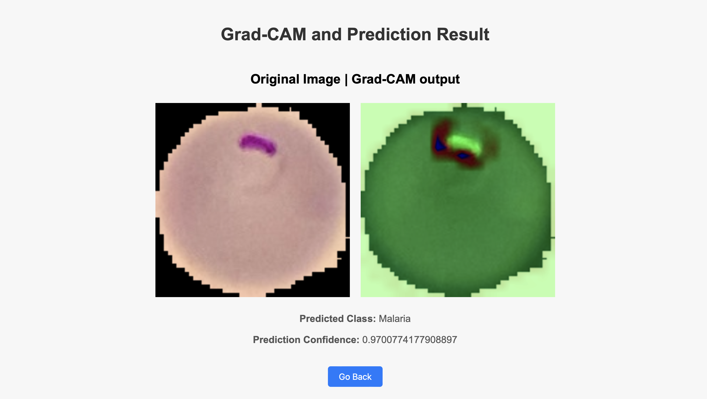

# Malaria Detection App

This repository contains a **Malaria Detection App** built using **FastAPI**, powered by a Convolutional Neural Network (CNN) for image classification, and enhanced with explainability through **Grad-CAM**. The app enables users to upload cell images and determines whether the given sample is infected with malaria or not.

---

## Table of Contents

- [Features](#features)  
- [Installation](#installation)  
- [Usage](#usage)  
- [Model Details](#model-details)  
- [API Endpoints](#api-endpoints)  
 

---

## Features

- **Malaria Detection**: Classify cell images as "Parasitized" or "Uninfected."
- **Explainability**: Provides a heatmap visualization of the regions the model focused on using Grad-CAM.
- **FastAPI Integration**: A fast and interactive API to serve predictions.
- **User-Friendly**: Easy image upload via REST API for quick results.

---

## Installation

1. **Clone the repository**:
   ```
   git clone https://github.com/your-username/malaria-detection-app.git
   cd malaria-detection-app
   
2. **Set up a virtual environment**:
   ``` 
   python3 -m venv venv
   source venv/bin/activate  # On Windows, use `venv\Scripts\activate`

3. ***Install dependencies***:
  ```
  pip install -r requirements.txt
  ```
4. ***Run the application***:
  ```
  fastapi run app.py --port 8000
  ```
5. ***Access the application***:

   Open your browser and navigate to http://127.0.0.1:8000.

---

## Usage

1. Upload a cell image through the provided UI or API endpoint.
2. Receive a prediction of whether the cell has Malaria or not.
3. View the Grad-CAM heatmap explaining the model's focus during prediction.




---

## Model Details

See experiments.ipynb for training details.

---

## API Endpoints

1. ***Predict Malaria***
- Endpoint: /predict
- Method: POST
- Description: Upload an image to get a prediction.
  
**Request**:
```json
{
  "file": "<image file>"
}
```
**Response**:
```json
{
  "prediction": "Malaria",
  "confidence": 0.98,
  "heatmap_url": "<heatmap image URL>"
}
```
